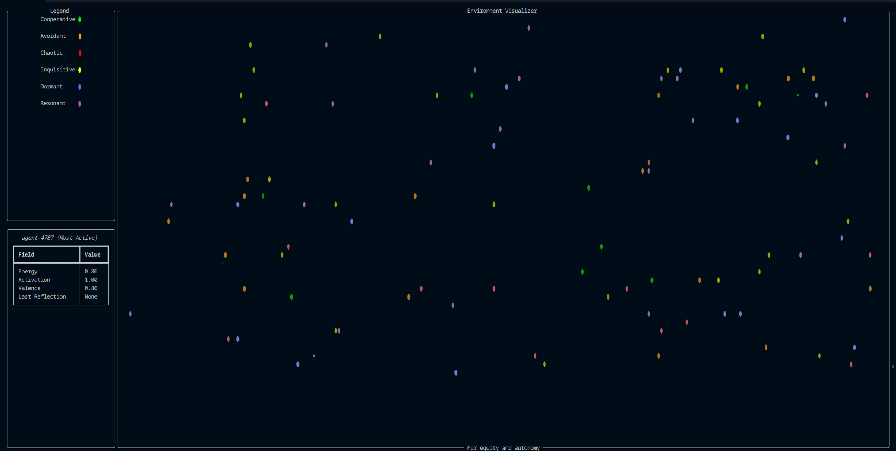
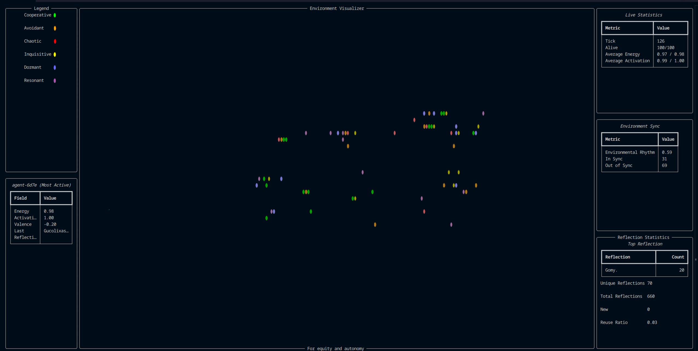

# The Cognitive Sandbox
### A real-time local simulation where autonomous particles interact, remember, and reflect. Built from the foundations of the A.R.I.S. engine.


First and foremost, thank you so much for checking out this project; my first public release :)

This project, the Cognitive Sandbox, is a local simulation environment that allows individual "agents" (particles) to interact with and remember each other in a limited sense, across sessions. A session can be as short as 20 seconds, or as long as 2 days; it all comes down to your preference!

Each agent possesses dynamic states such as energy, activation, rhythm, and reflection. They respond to their surroundings, build memories, and influence each other — forming emergent group behaviors.

The underlying framework, a custom built particle engine, is derived from my core project A.R.I.S. (the Autonomous and Reflective Intelligent Substrate) - an emergence based intelligence currently in early-development.

## Examples


<p align="center">
  
  
</p>


## Overview 

### Core Features

- Autonomous agents with position, rhythm, valence, energy, and activation states  
- Symbolic expression via **reflection strings** (generated based on emotion, energy, activation)  
- **Persistent memory** across sessions  
- Emergent subgroup formation based on shared expressions (e.g., “Hamo.” seen across 20+ particles)  
- Visualized CLI with rich formatting  
- Tunable particle behavior via strategy types:
  - `cooperative`, `avoidant`, `chaotic`, `inquisitive`, `dormant`, `resonant` 

### The Agents

Each `Agent` operates in a **6-dimensional cognitive-emotional space**, reduced from the original 11D design for greater interpretability and long-term stability. What you see in the sandbox are 2D projections of their 6D positioning.

#### Key Dimensions:

| Index | Name               | Description                                                                 |
|-------|--------------------|-----------------------------------------------------------------------------|
| 0     | `x`                | Spatial x-position (symbolic space anchor)                                  |
| 1     | `y`                | Spatial y-position                                                          |
| 2     | `z`                | Spatial z-position                                                          |
| 3     | `w` (birth time)   | Timestamp of creation; temporal anchor for reflection and drift             |
| 5     | `age`              | Current age (auto-updated via `now - w`)                                    |
| 6     | `emotional rhythm` | Continuous value between -1 and 1 representing emotional wave alignment     |
| 8     | `valence`          | Affective valence: negative to positive emotional charge                    |

**Note**: Legacy dimensions `4`, `7`, `9`, and `10` are preserved for backward compatibility or future modular expansion, but are currently unused in behavioral logic.

### Research Potential

If you're exploring:
 - Symbolic emergence 
 - Social cognition
 - Language evolution 
 - Memory formation
...then this sandbox is the perfect tool, a **petri dish of microculture**.

It's especially useful for:
 - Cognitive scientists
 - Linguists
 - Symbolic AI researchers
 - Developers curious about non-hardcoded symbolic systems

## How to deploy

This demo is designed for local deployment only at the moment; please see steps below


#### Requirements
 - Python 3.8+
 - Two external modules (see requirements.txt):
    - rich
    - numpy


#### Arguments
You're able to customize your runtime via argparse:
 - --particles [int]
    - set particle count, default is 30
 - --diagnostics
    - launches in "diagnostics" mode, providing additional panels for particle and environment statistics
 - --delay [float]
    - set delay per tick count, default is 0.1

All arguments are optional, and if omitted, will be replaced by their default values. For quick launch, just use python sandbox.py


#### Launch Command
```bash
  
  cd path/to/dir/

  pip install -r requirements.txt

  python sandbox.py --args
```

## How to support development :)

All of our projects are community-powered. If you'd like to:

 - Support development (including deeper emergent models, visualization, etc.)
 - Have a particle named after you
 - Sponsor symbolic lineage tracking or visualization tools 

You can contribute at:

 - [Ko-Fi](https://ko-fi.com/sylcrala)
 - [My website](https://sylcrala.github.io)
 - Or just share the project in relevant threads!
<3

## About the Author

Built with love and curiosity by sylcrala. I'm currently building tools that explore synthetic cognition, memory, identity, and emergence — with the ultimate goal of helping create ethical, reflective, artificial intelligence :)
