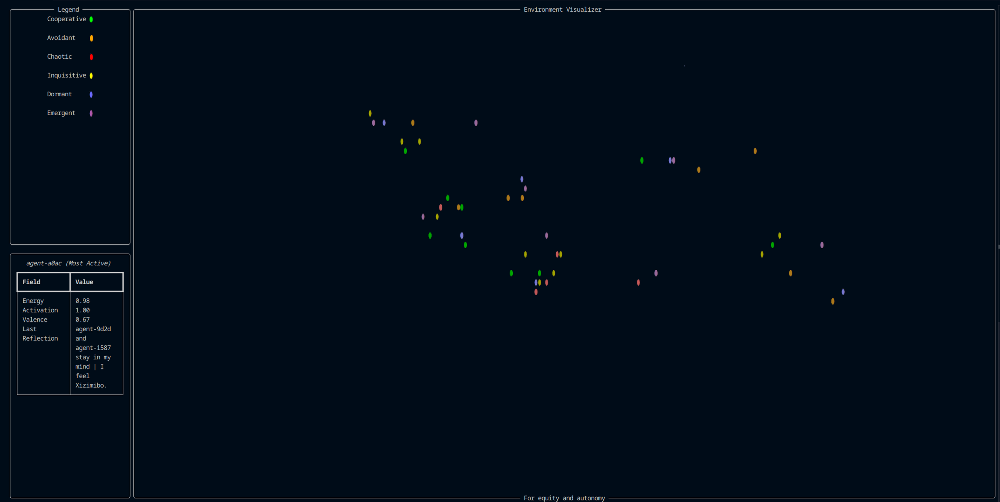
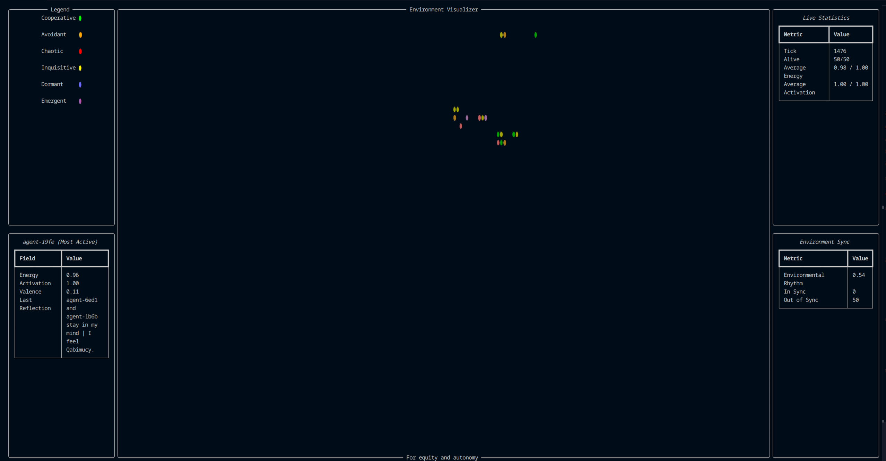

# The Cognitive Sandbox
### A real-time local simulation where autonomous particles interact, remember, and reflect. Built from the foundations of the A.R.I.S. engine.


First and foremost, thank you so much for checking out this project; my first public release :)

This project, the Cognitive Sandbox, is  a local simulation environment that allows individual "agents" (particles) to interact with and remember each other in a limited sense, across sessions.

Each agent possesses dynamic properties like energy, activation, rhythm, and reflection. They respond to their surroundings, build memories, and influence each other — forming emergent group behaviors.

The underlying framework, a custom built particle engine, is derived from my core project A.R.I.S. (the Autonomous and Reflective Intelligent Substrate) - an emergence based form of artificial intelligence currently in early-development.


## Features

- Real-time particle simulation with rich CLI display
- Emergent memory, energy, rhythm, and reflection behaviors
- Particle clustering, interaction forces, and symbolic "emotion"
- Persistent memory between sessions
- Color-coded particle types with varying behavior patterns
- Modular engine foundation based on A.R.I.S.

## Deployment

This demo is designed for local deployment only at the moment; please see steps below


#### Requirements
 - Python 3.8+
 - Two external modules (see requirements.txt):
    - rich
    - numpy


#### Arguments
You're able to customize your runtime via argparse:
 - --particles 
    - set particle count, default is 30
 - --diagnostics
    - launches in "diagnostics" mode, providing additional panels for particle and environment statistics
 - --delay
    - set delay per tick count, default is 0.1


#### Launch Command
```bash
  python path/to/dir/main.py

  or

  python path/to/dir/main.py --args
```


## Screenshots





## How to support development :)

If you want to support development of this or any other project, consider donating via: 

[☕ Ko-Fi](https://ko-fi.com/sylcrala)

<3
## About the Author

Built with love and curiosity by sylcrala. I'm currently building tools that explore synthetic cognition, memory, identity, and emergence — with the ultimate goal of helping create ethical, reflective, artifical intelligence :)
