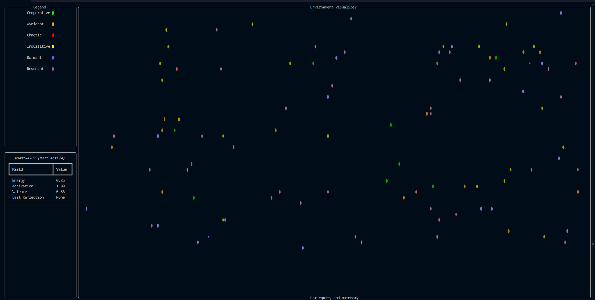
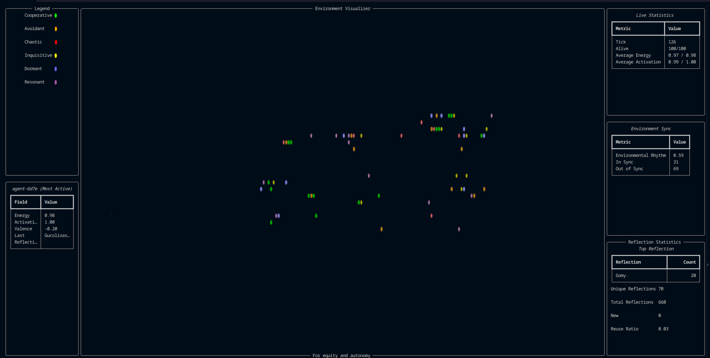

# The Cognitive Sandbox
*version: 2.0*
### A real-time local simulation where autonomous particles interact, remember, reproduce, and reflect.


First and foremost, thank you so much for checking out this project; my first public release :)

This project, the Cognitive Sandbox, is a local simulation environment that allows individual "agents" (particles) to interact with and remember each other in a limited sense, across sessions. A session can be as short as 20 seconds, or as long as you'd like!; each state occasionally saves to a local database, and will be restored on next launch for continuity.

Each agent possesses dynamic states such as energy, activation, rhythm, valence, and reflection. They respond to their surroundings, build memories, influence each other, and can reproduce — forming emergent group behaviors and lineages.

The underlying framework, a custom built particle engine, is derived as a simplified version of the engine from another project in development - the Particle-based Cognition Engine.

## Examples
<p align="center">

</p>
<p align="center">
  
  
</p>


## Overview 


### Core Features

- Autonomous agents with position, rhythm, valence, energy, and activation states  
- Symbolic expression via **reflection strings** (generated based on emotion, energy, activation)  
- **Emergent linguistics** — particles develop and share vocabulary through voice profiles  
- **Reproduction system** — particles with high energy and synchronized rhythms produce offspring with inherited traits  
- **Persistent memory** across sessions (SQLite-backed state)  
- Emergent subgroup formation based on shared expressions  
- **Interactive CLI** with mouse-clickable navigation bar for panel switching  
- Rich terminal visualization with real-time statistics  
- Tunable particle behavior via strategy types:
  - `cooperative`, `avoidant`, `chaotic`, `inquisitive`, `dormant`, `resonant`


### The Agents

Each `Agent` operates in an **11-dimensional cognitive-emotional space**. What you see in the sandbox are 2D projections of their higher-dimensional positioning. Note: `age` is derived from `w` (birth time) and is not considered its own independent dimension.


#### Key Dimensions:

| Index | Name               | Description                                                                 |
|-------|--------------------|-----------------------------------------------------------------------------|
| 0     | `x`                | Spatial x-position (symbolic space anchor)                                  |
| 1     | `y`                | Spatial y-position                                                          |
| 2     | `z`                | Spatial z-position                                                          |
| 3     | `w` (birth time)   | Timestamp of creation; used to derive age                                   |
| 4     | `t` (current time) | Localized time; used for temporal anchor drift calculations                 |
| 5     | `age`              | Current age (auto-updated via `now - w`)                                    |
| 6     | `emotional rhythm` | Continuous value between -1 and 1 representing emotional wave alignment     |
| 8     | `valence`          | Affective valence: negative to positive emotional charge                    |

**Note**: Legacy dimensions `7`, `9`, and `10` are preserved for backward compatibility or future modular expansion, but are currently unused in behavioral logic.


#### Particle Attributes:

| Attribute         | Range       | Description                                                |
|-------------------|-------------|------------------------------------------------------------|
| `energy`          | [0.0, 1.0]  | Resource for actions; decays and regenerates over time     |
| `activation`      | [0.0, 1.0]  | Alertness/activity level; low activation = death           |
| `max_energy`      | [0.5, 1.5]  | Individual cap on energy (can evolve through generations)  |
| `max_activation`  | [0.5, 1.5]  | Individual cap on activation                               |
| `generation`      | 0+          | Generational depth (0 = founder, 1+ = offspring)           |
| `voice_profile`   | Dict        | Linguistic characteristics for word generation             |


### Available Panels

The visualizer includes 7 interactive panels (click to toggle):

| Panel         | Description                                                    |
|---------------|----------------------------------------------------------------|
| **Legend**    | Particle type colors, size meanings, brightness formulas       |
| **Stats**     | Live population statistics, type distribution, energy/vitals   |
| **Diagnostics** | Environment rhythm sync, valence distribution, spatial spread |
| **Reflections** | Reflection analysis, top phrases, per-particle recent output  |
| **Genealogy** | Generation distribution, reproduction stats, prolific parents  |
| **Linguistics** | Word frequencies, voice profile diversity, context usage       |
| **Inspector** | All particles list, most active featured with full details     |


## How to deploy

This demo is designed for local deployment only at the moment; please see steps below


#### Requirements
 - Python 3.8+
 - Two external modules (see requirements.txt):
    - rich
    - numpy


#### Arguments
You're able to customize your runtime via argparse:
 - `--particles [int]`
    - Set particle count, default is 30
 - `--panel [name]`
    - Start with a panel open (legend, stats, diagnostics, reflections, genealogy, linguistics, inspector)
 - `--delay [float]`
    - Set delay per tick count, default is 0.1
 - `--ticks [int]`
    - Maximum ticks to run (default: indefinite)
 - `--norestore`
    - Start fresh without loading previous session state

All arguments are optional, and if omitted, will be replaced by their default values. For quick launch, just use `python start.py`


#### Launch Command
```bash
  
  cd path/to/dir/

  pip install -r requirements.txt

  python start.py --panel stats
```

#### Examples
```bash
  python start.py                        # Clean mode (field only)
  python start.py --panel stats          # Show statistics panel
  python start.py --panel genealogy      # Show genealogy panel
  python start.py --particles 50 --panel legend
  python start.py --norestore --panel inspector
```


## How to support development :)

Here's some ways you can either contribute to or support the development of this and other projects! 
 - Sponsoring the repo via the GitHub Sponsor button
 - Reporting any issues you find or submitting a PR for any features you might like!
 - If needed, contact me via [my website](https://sylcrala.github.io)
 - Or just share the project in relevant threads!
<3

See [LICENSE](LICENSE) for more information on reuse and contribution.

--

built with love by sylcrala :)
